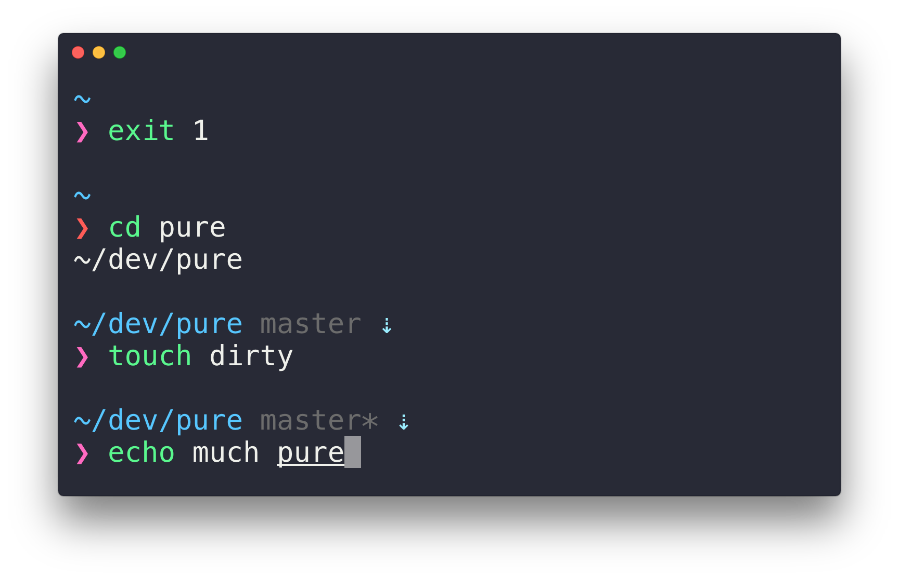

> Pretty, minimal and fast ZSH prompt



## Overview

Most prompts are cluttered, ugly and slow. We wanted something visually pleasing that stayed out of our way.

### Why?

- Comes with the perfect prompt character.
  Author went through the whole Unicode range to find it.
- Shows `git` branch and whether it's dirty (with a `*`).
- Indicates when you have unpushed/unpulled `git` commits with up/down arrows. *(Check is done asynchronously!)*
- Prompt character turns red if the last command didn't exit with `0`.
- Command execution time will be displayed if it exceeds the set threshold.
- Username and host only displayed when in an SSH session or a container.
- Shows the current path in the title and the [current folder & command](screenshot-title-cmd.png) when a process is running.
- Support VI-mode indication by reverse prompt symbol (Zsh 5.3+).
- Makes an excellent starting point for your own custom prompt.

## Colors

Colors can be configured for various parts of Pure prompt using
configuration options.

As explained in ZSH's [manual](http://zsh.sourceforge.net/Doc/Release/Zsh-Line-Editor.html#Character-Highlighting), color values can be:
- A decimal integer corresponding to the color index of your terminal. If your `$TERM` is `xterm-256color`, see this [chart](https://upload.wikimedia.org/wikipedia/commons/1/15/Xterm_256color_chart.svg).
- The name of one of the following nine colors: `black`, `red`, `green`, `yellow`, `blue`, `magenta`, `cyan`, `white`, and `default` (the terminal’s default foreground)
- `#` followed by an RGB triplet in hexadecimal format, for example
    `#424242`. Only if your terminal supports 24-bit colors (true color)
    or when the `zsh/nearcolor` module is loaded.

The following diagram shows where each color is applied on the prompt:

```
┌────────────────────────────────────────────────────── user
│      ┌─────────────────────────────────────────────── host
│      │           ┌─────────────────────────────────── path
│      │           │          ┌──────────────────────── git:branch
│      │           │          │     ┌────────────────── git:dirty
│      │           │          │     │ ┌──────────────── git:action
│      │           │          │     │ │        ┌─────── git:arrow
│      │           │          │     │ │        │ ┌───── git:stash
│      │           │          │     │ │        │ │ ┌─── execution_time
│      │           │          │     │ │        │ │ │
zaphod@heartofgold ~/dev/pure master* rebase-i ⇡ ≡ 42s
venv ❯
│    │
│    └───────────────────────────────────────────────── prompt
└────────────────────────────────────────────────────── virtualenv (or prompt:continuation)
```

## Integration

### [oh-my-zsh](https://github.com/robbyrussell/oh-my-zsh)

1. Set the `ZSH_THEME` to `""` in your `oh-my-zsh` settings.
2. Do not enable the following (incompatible) `oh-my-zsh` plugins: `vi-mode`, `virtualenv`.

**NOTE:** `oh-my-zsh` overrides the prompt so Pure must be ordered *after*
`oh-my-zsh` in your dotfiles.

## Team

[](https://sindresorhus.com) | [](https://github.com/mafredri)
---|---
[Sindre Sorhus](https://github.com/sindresorhus) | [Mathias Fredriksson](https://github.com/mafredri)
